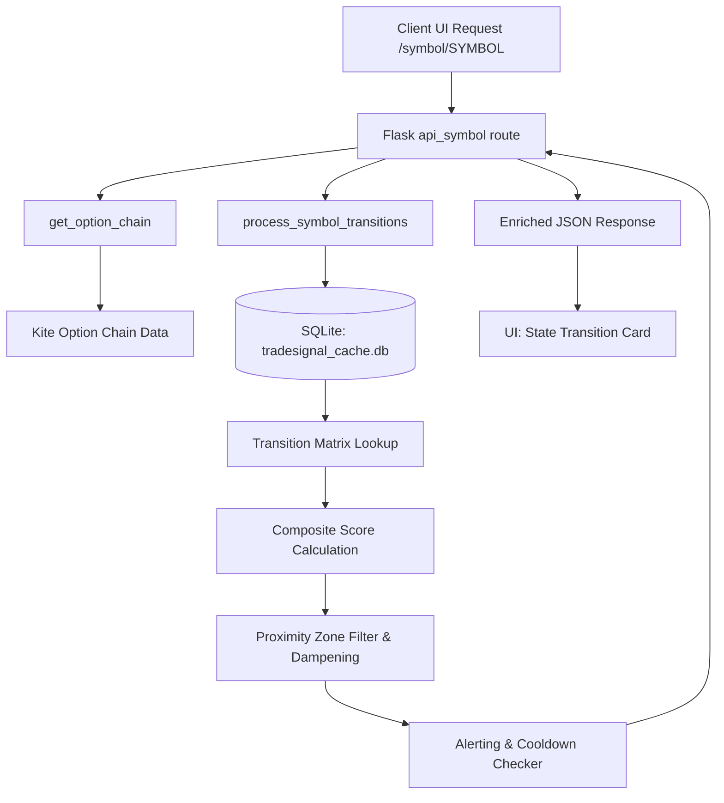

# State Transition Conviction Signal — Implementation Plan

This implementation plan details the non-disruptive integration of an institutional conviction scoring engine into the **OI Spurt Scanner** dashboard. 

The conviction engine tracks real-time state transitions of Call (CE) and Put (PE) options around the At-The-Money (ATM) strike zone to identify market biases. The proposed changes are designed to have **zero impact** on existing columns, routes, or background processes, serving as a modular, additive feature.

---

## 1. System Architecture Overview



---

## 2. Database Schema

We will use the existing `tradesignal_cache.db` to keep all persistent states. We will define two new, isolated tables:

### A. State Tracking Table (`oi_transition_states`)
Tracks the premium, OI, and classified state of each individual contract tick-by-tick.
```sql
CREATE TABLE IF NOT EXISTS oi_transition_states (
    symbol TEXT NOT NULL,
    strike REAL NOT NULL,
    expiry TEXT NOT NULL,
    leg TEXT NOT NULL, -- 'CE' or 'PE'
    premium REAL NOT NULL,
    oi INTEGER NOT NULL,
    state TEXT NOT NULL, -- 'LB', 'LU', 'SB', 'SC'
    updated_at TIMESTAMP DEFAULT CURRENT_TIMESTAMP,
    PRIMARY KEY (symbol, strike, expiry, leg)
);
```

### B. Alerts Journal Table (`oi_transition_alerts`)
Logs all fired alerts for cooldown checks.
```sql
CREATE TABLE IF NOT EXISTS oi_transition_alerts (
    symbol TEXT NOT NULL,
    strike REAL NOT NULL,
    expiry TEXT NOT NULL,
    alert_type TEXT NOT NULL, -- 'high', 'watch'
    composite_score REAL NOT NULL,
    ce_from_state TEXT NOT NULL,
    ce_to_state TEXT NOT NULL,
    pe_from_state TEXT NOT NULL,
    pe_to_state TEXT NOT NULL,
    alerted_at TIMESTAMP DEFAULT CURRENT_TIMESTAMP
);
```

---

## 3. Transition Matrix & Scoring Mechanics

Derived from `CE_PE_Transition_Conviction_Matrix.md`, the state machine maps single-leg state updates to directions (+1/-1) and strength weights:

### Weights Map
- **High**: `1.0`
- **Medium-High**: `0.75`
- **Medium**: `0.5`
- **Medium-Low**: `0.35`
- **Low**: `0.2`

### CE Leg Transition Matrix
```python
CE_TRANSITION_MATRIX = {
    # (FROM, TO) -> (bias, strength)
    ("LB", "LB"): ("bullish", "High"),
    ("LB", "LU"): ("bearish", "Low"),
    ("LB", "SB"): ("bearish", "High"),
    ("LB", "SC"): ("bullish", "Medium-High"),
    ("LU", "LB"): ("bullish", "Medium"),
    ("LU", "LU"): ("bearish", "Medium"),
    ("LU", "SB"): ("bearish", "High"),
    ("LU", "SC"): ("bullish", "Medium-High"),
    ("SB", "LB"): ("bullish", "High"),
    ("SB", "LU"): ("bearish", "Medium-Low"),
    ("SB", "SB"): ("bearish", "High"),
    ("SB", "SC"): ("bullish", "High"),
    ("SC", "LB"): ("bullish", "High"),
    ("SC", "LU"): ("bearish", "Medium"),
    ("SC", "SB"): ("bearish", "Medium-High"),
    ("SC", "SC"): ("bullish", "High"),
}
```

### PE Leg Transition Matrix
```python
PE_TRANSITION_MATRIX = {
    # (FROM, TO) -> (bias, strength)
    ("LB", "LB"): ("bearish", "High"),
    ("LB", "LU"): ("bullish", "Low"),
    ("LB", "SB"): ("bullish", "High"),
    ("LB", "SC"): ("bearish", "Medium-High"),
    ("LU", "LB"): ("bearish", "Medium"),
    ("LU", "LU"): ("bullish", "Medium"),
    ("LU", "SB"): ("bullish", "High"),
    ("LU", "SC"): ("bearish", "Medium-High"),
    ("SB", "LB"): ("bearish", "High"),
    ("SB", "LU"): ("bullish", "Medium-Low"),
    ("SB", "SB"): ("bullish", "High"),
    ("SB", "SC"): ("bearish", "High"),
    ("SC", "LB"): ("bearish", "High"),
    ("SC", "LU"): ("bullish", "Medium"),
    ("SC", "SB"): ("bullish", "Medium-High"),
    ("SC", "SC"): ("bearish", "High"),
}
```

### Score Computation
$$\text{Leg Score} = \text{direction} \times \text{strength\_weight}$$
$$\text{Composite Score} = \text{Score}_{\text{CE}} + \text{Score}_{\text{PE}}$$
- **High Conviction Alert**: $|\text{Composite Score}| \ge 1.5$
- **Medium Conviction Watch Alert**: $0.7 \le |\text{Composite Score}| < 1.5$
- **No Alert (Noise Floor)**: $|\text{Composite Score}| < 0.7$

---

## 4. Backend Implementation Plan

We will create a new, isolated python module at `app/backend/oi_transition_engine.py` containing the logic for state classification, zone routing, event checking, alerting, and database persistence.

### A. New File: `app/backend/oi_transition_engine.py`
```python
import sqlite3
import datetime
import os
import logging

DB_PATH = os.path.join(os.path.dirname(os.path.abspath(__file__)), 'tradesignal_cache.db')

CE_TRANSITION_MATRIX = { ... }
PE_TRANSITION_MATRIX = { ... }
STRENGTH_WEIGHTS = {
    "High": 1.0, "Medium-High": 0.75, "Medium": 0.5, "Medium-Low": 0.35, "Low": 0.2
}

def init_db():
    try:
        conn = sqlite3.connect(DB_PATH)
        cursor = conn.cursor()
        cursor.execute("""
            CREATE TABLE IF NOT EXISTS oi_transition_states (
                symbol TEXT NOT NULL,
                strike REAL NOT NULL,
                expiry TEXT NOT NULL,
                leg TEXT NOT NULL,
                premium REAL NOT NULL,
                oi INTEGER NOT NULL,
                state TEXT NOT NULL,
                updated_at TIMESTAMP DEFAULT CURRENT_TIMESTAMP,
                PRIMARY KEY (symbol, strike, expiry, leg)
            )
        """)
        cursor.execute("""
            CREATE TABLE IF NOT EXISTS oi_transition_alerts (
                symbol TEXT NOT NULL,
                strike REAL NOT NULL,
                expiry TEXT NOT NULL,
                alert_type TEXT NOT NULL,
                composite_score REAL NOT NULL,
                ce_from_state TEXT NOT NULL,
                ce_to_state TEXT NOT NULL,
                pe_from_state TEXT NOT NULL,
                pe_to_state TEXT NOT NULL,
                alerted_at TIMESTAMP DEFAULT CURRENT_TIMESTAMP
            )
        """)
        conn.commit()
    except Exception as e:
        logging.getLogger(__name__).error(f"Failed to initialize transition DB: {e}")
    finally:
        conn.close()

def classify_state(current_premium, last_premium, current_oi, last_oi, prev_state, is_atm_zone):
    """Classifies single-leg buildup based on premiums & OI deltas."""
    if last_premium is None or last_oi is None:
        return "Flat"
        
    premium_diff = current_premium - last_premium
    oi_diff = current_oi - last_oi
    
    # ATM-specific filters: require minimum thresholds to prevent noise-based flipping
    if is_atm_zone:
        # Minimum change required: 0.5% premium move, 1.0% OI shift
        if abs(premium_diff) < (last_premium * 0.005) or abs(oi_diff) < (last_oi * 0.01):
            return prev_state if prev_state else "Flat"
            
    if premium_diff > 0 and oi_diff > 0:
        return "LB"
    elif premium_diff < 0 and oi_diff < 0:
        return "LU"
    elif premium_diff < 0 and oi_diff > 0:
        return "SB"
    elif premium_diff > 0 and oi_diff < 0:
        return "SC"
        
    return prev_state if prev_state else "Flat"

def process_symbol_transitions(symbol, chain_rows, expiry, ltp, iv_event_windows=[]):
    init_db()
    
    # Sort option chain to map index proximity
    sorted_chain = sorted(chain_rows, key=lambda x: x["strike"])
    atm_idx = min(range(len(sorted_chain)), key=lambda i: abs(sorted_chain[i]["strike"] - ltp))
    atm_strike = sorted_chain[atm_idx]["strike"]
    
    today_str = datetime.date.today().isoformat()
    is_event_window = today_str in iv_event_windows
    
    strike_details = []
    triggered_alerts = []
    
    conn = sqlite3.connect(DB_PATH)
    cursor = conn.cursor()
    
    for i, row in enumerate(sorted_chain):
        strike = row["strike"]
        dist = abs(i - atm_idx)
        
        # Zone Proximity Routing (ATM±10)
        if dist <= 3:
            zone = "ATM±3"       # Full transition scoring + alerts
        elif dist <= 7:
            zone = "ATM±4-7"     # Registry log only, no alerts
        elif dist <= 10:
            zone = "ATM±8-10"    # Log with floor filter, no alerts
        else:
            continue             # Ignore outer strikes
            
        legs_data = {}
        for leg in ("CE", "PE"):
            prefix = leg.lower()
            curr_prem = row[f"{prefix}_ltp"]
            curr_oi = row[f"{prefix}_oi"]
            curr_vol = row[f"{prefix}_vol"]
            
            # ATM±8-10 Zone: Require minimum floor filter
            if zone == "ATM±8-10":
                min_oi = 25000 if symbol in EXCHANGE_MAP else 2000
                if curr_oi < min_oi:
                    continue
            
            # Fetch previous state
            cursor.execute("""
                SELECT premium, oi, state FROM oi_transition_states
                WHERE symbol = ? AND strike = ? AND expiry = ? AND leg = ?
            """, (symbol, strike, expiry, leg))
            db_row = cursor.fetchone()
            
            if db_row is None:
                # Seed baseline state from yesterday's EOD
                prev_prem = row[f"{prefix}_prev_ltp"]
                prev_oi = row[f"{prefix}_prev_oi"]
                
                # Seed state
                base_state = "Flat"
                if prev_prem and prev_oi:
                    prem_up = curr_prem > prev_prem
                    oi_up = curr_oi > prev_oi
                    if prem_up and oi_up: base_state = "LB"
                    elif not prem_up and not oi_up: base_state = "LU"
                    elif not prem_up and oi_up: base_state = "SB"
                    elif prem_up and not oi_up: base_state = "SC"
                    
                cursor.execute("""
                    INSERT INTO oi_transition_states (symbol, strike, expiry, leg, premium, oi, state)
                    VALUES (?, ?, ?, ?, ?, ?, ?)
                """, (symbol, strike, expiry, leg, curr_prem, curr_oi, base_state))
                
                legs_data[leg] = {"from_state": "Seed", "to_state": base_state, "score": 0.0, "transition_str": "Seeded"}
            else:
                last_prem, last_oi, last_state = db_row
                new_state = classify_state(curr_prem, last_prem, curr_oi, last_oi, last_state, (zone == "ATM±3"))
                
                # Update DB snapshot
                cursor.execute("""
                    UPDATE oi_transition_states
                    SET premium = ?, oi = ?, state = ?, updated_at = CURRENT_TIMESTAMP
                    WHERE symbol = ? AND strike = ? AND expiry = ? AND leg = ?
                """, (curr_prem, curr_oi, new_state, symbol, strike, expiry, leg))
                
                matrix = CE_TRANSITION_MATRIX if leg == "CE" else PE_TRANSITION_MATRIX
                bias, strength = matrix.get((last_state, new_state), ("neutral", "Low"))
                
                direction = 1 if bias == "bullish" else -1 if bias == "bearish" else 0
                weight = STRENGTH_WEIGHTS.get(strength, 0.2)
                
                # Event Dampening logic
                if zone == "ATM±3" and is_event_window:
                    weight = 0.2 # Force minimum strength during known major events
                    strength = f"{strength} (Event Dampened)"
                    
                legs_data[leg] = {
                    "from_state": last_state, "to_state": new_state,
                    "score": direction * weight, "transition_str": f"{last_state}→{new_state}",
                    "strength": strength
                }
                
        # Scoring & Alerting (requires both CE and PE details)
        if "CE" in legs_data and "PE" in legs_data:
            ce_score = legs_data["CE"]["score"]
            pe_score = legs_data["PE"]["score"]
            comp_score = ce_score + pe_score
            abs_score = abs(comp_score)
            
            strike_details.append({
                "strike": strike,
                "zone": zone,
                "ce": legs_data["CE"],
                "pe": legs_data["PE"],
                "composite": round(comp_score, 2),
                "bias": "Bullish" if comp_score > 0 else "Bearish" if comp_score < 0 else "Neutral",
                "strength": "High" if abs_score >= 1.5 else "Medium" if abs_score >= 0.7 else "Low"
            })
            
            # Trigger alerts inside ATM±3 zone with Cooldown support
            if zone == "ATM±3" and abs_score >= 0.7:
                # 5 minute cooldown query
                cursor.execute("""
                    SELECT COUNT(*) FROM oi_transition_alerts
                    WHERE symbol = ? AND strike = ? AND expiry = ? AND alerted_at >= datetime('now', '-5 minutes')
                """, (symbol, strike, expiry))
                in_cooldown = cursor.fetchone()[0] > 0
                
                if not in_cooldown:
                    alert_type = "high" if abs_score >= 1.5 else "watch"
                    cursor.execute("""
                        INSERT INTO oi_transition_alerts
                        (symbol, strike, expiry, alert_type, composite_score, ce_from_state, ce_to_state, pe_from_state, pe_to_state)
                        VALUES (?, ?, ?, ?, ?, ?, ?, ?, ?)
                    """, (symbol, strike, expiry, alert_type, comp_score, legs_data["CE"]["from_state"], legs_data["CE"]["to_state"], legs_data["PE"]["from_state"], legs_data["PE"]["to_state"]))
                    
                    triggered_alerts.append({
                        "strike": strike,
                        "type": alert_type,
                        "score": round(comp_score, 2),
                        "message": f"CE {legs_data['CE']['transition_str']} + PE {legs_data['PE']['transition_str']} -> Composite: {comp_score:+.2f}"
                    })
                    
    conn.commit()
    conn.close()
    
    # Symbol level stats (ATM strike transitions)
    atm_detail = next((d for d in strike_details if d["strike"] == atm_strike), None)
    return {
        "symbol": symbol,
        "atm_strike": atm_strike,
        "composite_score": atm_detail["composite"] if atm_detail else 0.0,
        "bias": atm_detail["bias"] if atm_detail else "Neutral",
        "strike_details": strike_details,
        "alerts": triggered_alerts,
        "is_event_window": is_event_window
    }

def run_housekeeping():
    """Deletes rows for expired option contracts, preserving live active expiries."""
    try:
        today_str = datetime.date.today().isoformat()
        conn = sqlite3.connect(DB_PATH)
        cursor = conn.cursor()
        cursor.execute("DELETE FROM oi_transition_states WHERE expiry < ?", (today_str,))
        cursor.execute("DELETE FROM oi_transition_alerts WHERE expiry < ?", (today_str,))
        conn.commit()
        conn.close()
    except Exception as e:
        logging.getLogger(__name__).warning(f"Housekeeping failed: {e}")
```

### B. Integration into `app/backend/oi_spurt_routes.py`
We will call the module logic synchronously inside the `/symbol/<symbol>` route, adding the result as an enrichment payload block:

```python
# Import the transition engine at the top
from oi_transition_engine import process_symbol_transitions, run_housekeeping

# Trigger housekeeping in server startup loop or in a lazy manner
# (run once per day on server spin up)
_housekeeping_done = False

@oi_spurt_bp.route("/symbol/<symbol>")
def api_symbol(symbol):
    global _housekeeping_done
    if not _housekeeping_done:
        # Run housekeeping once on first detail call
        import threading
        threading.Thread(target=run_housekeeping, daemon=True).start()
        _housekeeping_done = True
        
    ...
    chain, expiry, futures_oi, futures_oi_prev, futures_ltp, futures_prev_close, cerr = get_option_chain(kite, sym)
    
    # Calculate state transitions conviction
    transition_data = None
    if chain and expiry and ltp:
        try:
            # We can pass some custom event dates or load from database configs
            event_dates = ["2026-08-01"] # e.g. major policy events
            transition_data = process_symbol_transitions(sym, chain, expiry, ltp, iv_event_windows=event_dates)
        except Exception as ex:
            logging.error(f"Transition Conviction engine failed: {ex}")
            
    return jsonify({
        "symbol":           sym,
        ...
        "transition_conviction": transition_data
    })
```

---

## 5. Frontend Integration Plan (`app/oi-spurt-scanner.html`)

We will place a visual card directly below the **Pivot, Support & Resistance** panel in `buildDetail()`. 

### A. Placement Location
Directly below the CSS class `.cards-row` containing the 3-Layer Analytics and Pivots:
```html
    <!-- (c) F&O 3-Layer Analytics Dashboard & (d) Pivot Levels -->
    <div class="sec-head">📊 F&amp;O 3-Layer Analytics &nbsp;|&nbsp; 📐 Pivot Levels</div>
    <div class="cards-row">
      <div style="flex: 1.2; display: flex; flex-direction: column;">
        ${layer1Html}
        ${layer2Html}
        ${layer3Html}
      </div>
      <div class="layer-card" style="flex: 0.8; height: fit-content;">
        <div class="layer-title">📐 Pivot, Support &amp; Resistance <span>${pivotSrcBadge}</span></div>
        ${pivotRows}
      </div>
    </div>
    
    <!-- INSERT TRANSITION CONVICTION COMPONENT HERE -->
    ${transitionConvictionHtml}
```

### B. JavaScript Rendering Logic
In `buildDetail()`, extract the new payload key `d.transition_conviction` and construct the visual layout:

```javascript
// Inside buildDetail()
const tc = d.transition_conviction;
let transitionConvictionHtml = '';

if (tc && tc.strike_details && tc.strike_details.length > 0) {
    const atmDetails = tc.strike_details.filter(s => s.zone === 'ATM±3');
    const registryDetails = tc.strike_details.filter(s => s.zone === 'ATM±4-7');
    
    const compositeVal = tc.composite_score;
    const biasColor = compositeVal > 0 ? 'var(--green)' : compositeVal < 0 ? 'var(--red)' : 'var(--muted)';
    const biasText = tc.bias;
    
    // Scale slider position from -2.0 (Bearish) to +2.0 (Bullish) to percent (0% - 100%)
    const pct = Math.min(100, Math.max(0, ((compositeVal + 2) / 4) * 100));
    
    // Render Alert Banner
    let alertBannerHtml = '';
    if (tc.alerts && tc.alerts.length > 0) {
        alertBannerHtml = tc.alerts.map(a => `
            <div style="background: rgba(220,38,38,0.1); border: 1px solid rgba(220,38,38,0.35); border-radius: 4px; padding: 5px 8px; margin-bottom: 5px; font-size: 9px; color: var(--red); display: flex; align-items: center; gap: 5px;">
                <span>🚨</span>
                <span><b>${a.type.toUpperCase()}:</b> ${a.message}</span>
            </div>
        `).join('');
    } else {
        alertBannerHtml = `
            <div style="background: rgba(128,128,128,0.06); border: 1px solid rgba(128,128,128,0.15); border-radius: 4px; padding: 5px 8px; margin-bottom: 5px; font-size: 8.5px; color: var(--muted); text-align: center;">
                No active alerts in this cycle (or under cooldown suppression)
            </div>
        `;
    }
    
    // Build ATM±3 table rows
    const atmRows = atmDetails.map(row => {
        const ceScore = row.ce.score;
        const peScore = row.pe.score;
        const ceScoreStr = ceScore > 0 ? `+${ceScore}` : ceScore;
        const peScoreStr = peScore > 0 ? `+${peScore}` : peScore;
        const isATM = row.strike === tc.atm_strike;
        
        return `
            <tr style="${isATM ? 'background: rgba(2, 132, 199, 0.06); font-weight: 600;' : ''}">
                <td><b>${fmt(row.strike, 0)}</b> ${isATM ? '<span style="font-size:7px; background:var(--accent); color:#fff; padding:1px 3px; border-radius:2px; margin-left:3px;">ATM</span>' : ''}</td>
                <td>
                    <span class="badge-buildup ${buCls(row.ce.to_state)}" style="font-size: 8px; padding: 1px 4px;">${row.ce.from_state || '–'} → ${row.ce.to_state}</span>
                    <span style="font-size: 8px; color: ${ceScore >= 0 ? 'var(--green)' : 'var(--red)'}; margin-left: 3px;">(${ceScoreStr})</span>
                </td>
                <td>
                    <span class="badge-buildup ${buCls(row.pe.to_state)}" style="font-size: 8px; padding: 1px 4px;">${row.pe.from_state || '–'} → ${row.pe.to_state}</span>
                    <span style="font-size: 8px; color: ${peScore >= 0 ? 'var(--green)' : 'var(--red)'}; margin-left: 3px;">(${peScoreStr})</span>
                </td>
                <td style="color: ${row.composite >= 0 ? 'var(--green)' : 'var(--red)'}; font-weight: 700;">
                    ${row.composite >= 0 ? '+' : ''}${fmt(row.composite)}
                </td>
                <td>
                    <span class="tag ${row.strength === 'High' ? 'tag-red' : row.strength === 'Medium' ? 'tag-yellow' : 'tag-blue'}" style="font-size: 7.5px; padding: 1px 4px;">
                        ${row.strength}
                    </span>
                </td>
            </tr>
        `;
    }).join('');
    
    transitionConvictionHtml = `
        <div class="sec-head">🔄 State Transition Conviction</div>
        <div class="layer-card" style="margin-bottom: 7px; border: 1px solid var(--border); border-radius: 7px; padding: 10px 12px;">
            <div class="layer-title">
                🔄 STATE TRANSITION CONVICTION METER
                <span style="font-size: 7.5px; background: rgba(2, 132, 199, 0.1); color: var(--accent); border: 1px solid rgba(2, 132, 199, 0.2); border-radius: 3px; padding: 1px 4px;">ATM±3 Zone</span>
            </div>
            
            <div class="cards-row" style="grid-template-columns: 1.25fr 0.75fr; gap: 8px; margin-bottom: 5px;">
                <!-- Left: Gauge and Alerts -->
                <div>
                    <div style="display: flex; align-items: center; justify-content: space-between; margin-bottom: 4px;">
                        <div>
                            <div style="font-size: 13px; font-weight: 700; color: ${biasColor};">
                                Composite Score: ${compositeVal >= 0 ? '+' : ''}${fmt(compositeVal)}
                            </div>
                            <div style="font-size: 9px; color: var(--muted2);">
                                Active Bias: <b style="color: ${biasColor}">${biasText}</b>
                            </div>
                        </div>
                        <div style="text-align: right;">
                            <div style="font-size: 8px; color: var(--muted2);">IV Window check</div>
                            <span class="tag ${tc.is_event_window ? 'tag-yellow' : 'tag-green'}" style="font-size: 7px; padding: 1px 4px;">
                                ${tc.is_event_window ? '⚠️ Event Dampened' : '✓ Normal'}
                            </span>
                        </div>
                    </div>
                    
                    <!-- Visual Gauge Slider -->
                    <div style="margin-bottom: 6px; position: relative;">
                        <div style="height: 5px; background: linear-gradient(90deg, var(--red) 0%, #e2e8f0 50%, var(--green) 100%); border-radius: 3px; width: 100%;"></div>
                        <div style="position: absolute; top: -3.5px; left: calc(${pct}% - 3px); width: 6px; height: 12px; background: var(--text); border: 1px solid #fff; border-radius: 2px; box-shadow: 0 1px 3px rgba(0,0,0,0.25);"></div>
                    </div>
                    <div style="display: flex; justify-content: space-between; font-size: 7.5px; color: var(--muted2); margin-bottom: 8px;">
                        <span>Bearish (-2.0)</span>
                        <span>Neutral (0.0)</span>
                        <span>Bullish (+2.0)</span>
                    </div>
                    
                    ${alertBannerHtml}
                </div>
                
                <!-- Right: Wall Strength Registry -->
                <div style="background: rgba(128,128,128,0.03); border: 1px solid var(--border); border-radius: 6px; padding: 6px 8px;">
                    <div style="font-size: 8px; font-weight: 700; color: var(--muted2); text-transform: uppercase; margin-bottom: 4px; border-bottom: 1px solid rgba(128,128,128,0.1); padding-bottom: 2px;">
                        🛡️ Wall Strength Registry (ATM±4–7)
                    </div>
                    <div style="max-height: 85px; overflow-y: auto; font-size: 8px; color: var(--text);">
                        ${registryDetails.length > 0 ? registryDetails.map(r => `
                            <div style="display:flex; justify-content:space-between; margin-bottom:3px; padding-bottom:3px; border-bottom:1px dashed rgba(128,128,128,0.08);">
                                <span><b>Strike ${fmt(r.strike, 0)}:</b></span>
                                <span>
                                    CE:<span class="${r.ce.to_state === 'LB' || r.ce.to_state === 'SC' ? 'pos' : 'neg'}">${r.ce.to_state}</span> | 
                                    PE:<span class="${r.pe.to_state === 'LB' || r.pe.to_state === 'SC' ? 'pos' : 'neg'}">${r.pe.to_state}</span>
                                </span>
                            </div>
                        `).join('') : '<div style="color:var(--muted); font-style:italic; font-size: 7.5px;">No logged strikes</div>'}
                    </div>
                </div>
            </div>
            
            <!-- ATM±3 Strikes Grid -->
            <table class="mt" style="width: 100%; margin-top: 4px;">
                <thead>
                    <tr>
                        <th>Strike</th>
                        <th>CE Transition (Score)</th>
                        <th>PE Transition (Score)</th>
                        <th>Composite</th>
                        <th>Strength</th>
                    </tr>
                </thead>
                <tbody>
                    ${atmRows}
                </tbody>
            </table>
        </div>
    `;
}
```

---

## 6. Implementation Verification & Safety Checks

To guarantee zero impact on the existing codebase:
1. **Error Isolation**: The engine calls are wrapped inside try-except blocks. If the SQLite query fails or files are locked, the route falls back seamlessly and does not disrupt standard data rendering.
2. **Key Protection**: No existing JSON attributes are modified or deleted in the endpoint. All transition state indicators are delivered via the new `transition_conviction` key.
3. **Database Contention**: The SQLite transactions use a dedicated connection pool setup which opens and closes immediately on each invocation, preventing write locks.
4. **Housekeeping Safety**: Housekeeping runs asynchronously in a daemon thread on the first request of the day, ensuring live option chain fetches are never blocked by cleanup operations.
