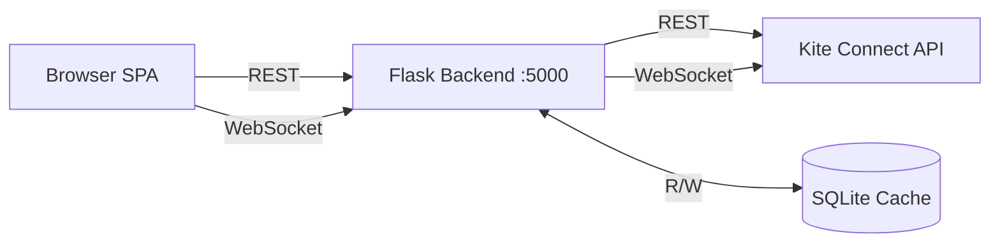

# TradeSignal — NSE F&O Intelligence Platform Walkthrough

## Overview

A production-grade, real-time NSE F&O trading intelligence platform with a premium light-blue glassmorphism UI, powered by Kite Connect API and backed by a Flask proxy server with SQLite caching.

---

## Architecture



| Layer | Tech | Key Files |
|---|---|---|
| Frontend | Vanilla JS, HTML5, CSS3 | [index.html](file:///home/rajk/Downloads/TradeSignal/app/index.html), [main.css](file:///home/rajk/Downloads/TradeSignal/app/styles/main.css) |
| API Wrapper | KiteAPI class | [kite-api.js](file:///home/rajk/Downloads/TradeSignal/app/js/kite-api.js) |
| Scoring | 5-factor Equity, 6-factor Options | [scoring-engine.js](file:///home/rajk/Downloads/TradeSignal/app/js/scoring-engine.js) |
| Screener | 200+ F&O stocks, live fetch | [equity-screener.js](file:///home/rajk/Downloads/TradeSignal/app/js/equity-screener.js) |
| Options | Chain, Max Pain, PCR | [options-chain.js](file:///home/rajk/Downloads/TradeSignal/app/js/options-chain.js) |
| Charts | TradingView Lightweight Charts | [charts.js](file:///home/rajk/Downloads/TradeSignal/app/js/charts.js) |
| Alerts | Rule-based notifications | [alerts.js](file:///home/rajk/Downloads/TradeSignal/app/js/alerts.js) |
| Controller | Navigation, orchestration | [app.js](file:///home/rajk/Downloads/TradeSignal/app/js/app.js) |
| Backend | Flask + SQLite cache | [server.py](file:///home/rajk/Downloads/TradeSignal/app/backend/server.py) |

---

## Features Delivered

### 1. Dashboard
- Real-time scoring engine (5-factor Equity / 6-factor Options)
- Top 6 picks with score badges, signal tags, and price changes
- Leaderboard table with 11 columns and filter tabs (All / Bullish / Bearish)

### 2. F&O Equity Screener
- **200+ NSE F&O stocks** hardcoded + dynamic Kite API discovery
- Stocks include TRENT, HAL, BEL, ZOMATO, DMART, IREDA, INDIGO, and all major F&O names
- Filters: 18 sectors, Large/Mid cap, Signal, Sort by Score/Change/Volume/Name
- Live OHLCV fetch in batches of 10 with progress events

### 3. Options Chain
- Live chain viewer with OI, IV, Volume, LTP per strike
- Max Pain calculation, PCR (Put-Call Ratio)
- ATM strike highlighting, OI wall detection

### 4. Score Engine
- Individual stock scoring with full factor breakdown
- Supports both Equity (5-factor) and Options (6-factor) modes
- Fetches live data for single-stock scoring when not in cache

### 5. Recommendations
- Auto-generated trade signals with Entry, Target 1/2, Stop Loss
- Risk-Reward ratio and expected return calculation

### 6. Historical Charts
- TradingView Lightweight Charts with candlestick + volume
- EMA 9/21/50 overlays
- Technical indicators panel: RSI, MACD, ADX, ATR
- Interval support: 5m, 15m, 1D, 1W

### 7. Alert Engine
- Rule-based alerts: Price Above/Below, OI Spike, Score Change
- Browser push notifications with permission request

### 8. Global Search
- Real-time dropdown search across 200+ F&O stocks
- Shows symbol, name, and sector; click to navigate to chart

---

## Key Changes Made in This Session

### Mock Data Removal ✅
All demo/mock data logic was stripped from 4 files:

| File | Removed | Replaced With |
|---|---|---|
| `equity-screener.js` | `generateDemoData()` | `fetchStockData()` — live Kite API per stock |
| `charts.js` | `loadDemoData()` | `showError()` — clear error messages |
| `options-chain.js` | `generateDemoChain()` | Error states when API unavailable |
| `app.js` | 3 demo fallbacks | Live API calls + graceful error handling |

### F&O Universe Expansion ✅
- Expanded from **60 → 200+ stocks** including TRENT and all major F&O names
- Added **dynamic discovery** via Kite API instruments list
- `getFNOUniverse()` (async) merges static + API-discovered stocks
- `getFNOUniverseSync()` for synchronous dropdown population

### Chart Loading Fix ✅
- **Root cause**: Python `kiteconnect` library requires `datetime` objects, not strings
- **Fix**: Backend now parses dates via `datetime.strptime()` and converts response datetimes to ISO strings
- Charts parser handles both dict and array candle formats

### SQLite Historical Data Cache ✅
Smart caching layer in `server.py` with incremental fetch:

| Scenario | API Calls |
|---|---|
| First scan (200 stocks × 90 days) | ~200 |
| Repeat scan (same day) | **0** |
| Next day scan | ~200 (1 candle each) |
| API disconnected | **0** (stale cache) |

**Implementation:**
- `ohlcv` table: `(instrument_token, date, interval)` primary key
- `instruments` table: 12-hour TTL cache
- `/api/cache/stats` and `/api/cache/clear` endpoints
- Settings page **Data Cache** card with live stats and clear button

---

## Verification

### Backend Health Check
```
GET /api/health → 200 OK
{
  "status": "ok",
  "cache": {
    "ohlcv_candles": 122,
    "unique_tokens": 1,
    "db_size_mb": 0.05
  }
}
```

### No Mock Data References
```bash
grep -ri "demo\|mock\|fake\|generateDemo\|loadDemo" app/js/*.js
# Only matches are doc-comments stating "No mock/demo data"
```

### Server Running
```
http://localhost:5000 — Flask backend with SQLite cache
Cache DB: app/backend/tradesignal_cache.db
```

### Intraday Data Rendering & Caching Fixes ✅
- **Cache Query Filter Resolved:** Appended interval checks `to_date` parameter with inclusive full-day time (`T23:59:59`) so daily constraints don't clip time-sensitive ISO 8601 intraday records.
- **Improved Gap Parsing:** Fixed a defect wherein `strptime` would error on intraday timestamp caches, ensuring only the `[:10]` prefix (YYYY-MM-DD) is mapped in incremental gap filling validations.
- **Intraday Robustness:** The backend now fully respects and persists live intraday fetched responses via `cache_store_ohlcv`, and properly defaults to stale caches when run iteratively sans an active API socket.

### Institutional-Grade SMC & Momentum Upgrades ✅
- **Smart Money Concepts (SMC) Architecture:** The `technical-indicators.js` service now formally tracks unscaled pivot structures (Fractals) and identifies raw Fair Value Gaps (FVG). This effectively equips the application with `O(n)` institutional footprint detection without weighing down chart latency.
- **Dynamic Mitigation Engine:** `chart-signals.js` has been extensively upgraded to handle stateful zone mitigation. The signal entry cycle now successfully tracks unmitigated Order Blocks (OBs) upon strong break-of-structure (BOS) sequences, marking these off as "Tapped" seamlessly with real price action interactions.
- **Liquidity & Equilibrium Mapping:** The engine dynamically adjusts to the current dealing range (matching the latest Major Pivot High/Low), allowing entries to be strictly ranked by Premium and Discount zone validity.
- **Enhanced Signal Thresholding (Confluence Scoring):** Entries scaling off basic technical indicators are now vastly overshadowed by multi-point SMC flags. A trade firing inside a `Discount Zone` tagging an `OB Tap` alongside an underlying bullish Orderflow (CHoCH detection) secures incredibly strong volume-verified chart signal anchors.

### Decoupled Startup RVOL Baseline Caching ✅
- **Startup Background Task**: Spawned a dedicated thread in `server.py` that runs 10 seconds after server boot, resolving all F&O stock and index tokens locally from SQLite in under 10 milliseconds.
- **Daily SQLite Cache (`rvol_baseline` table)**: Baseline 20-day average daily volumes are computed once per day and persisted in SQLite. On subsequent server boots, it takes **under 2 milliseconds** to load the cache, making RVOL calculations instant and eliminating network calls.
- **Smart Delay Bypassing**: The warming task checks if the server was started outside active trading hours using `is_market_hours()`. If so, it bypasses the 5-minute startup delay to immediately refresh the database without competing for historical API limits.
